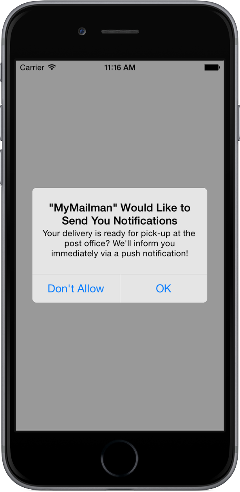

# APNPermissionRequest

[](https://travis-ci.org/tilowestermann/APNPermissionRequest)
[](http://cocoadocs.org/docsets/APNPermissionRequest)
[](http://cocoadocs.org/docsets/APNPermissionRequest)
[](http://cocoadocs.org/docsets/APNPermissionRequest)

APNPermissionRequest allows your users to make informed choices on whether to allow or disallow push notifications. The defauilt push notification permission request doesn't give a hint on the nature of notifications and users might deny the request just because they feel unsure. 
With APNPermissionRequest you may add a) an additional explanatory string to the request and also b) notification settings, so that the user may decide which modality to receive, without navigating to the system Settings app.

APNPermissionRequest is inspired by [ClusterPrePermissions](https://github.com/clusterinc/ClusterPrePermissions).

## Usage

To run the example project, clone the repo, and run `pod install` from the Example directory first.

### Permission request with explanation



```objective-c
APNPermissionRequest *request = [APNPermissionRequest sharedRequest];
[request showWithType: APNTypeAlert | APNTypeSound
                title:@"\"MyMailman\" Would Like to Send You Notifications."
              message:@"Your delivery is ready for pick-up at the post office? We'll inform you immediately via a push notification!"
      denyButtonTitle:@"Don't allow"
     grantButtonTitle:@"OK"
    completionHandler:^(BOOL hasPermission,
                        APNPermissionRequestDialogResult userDialogResult,
                        APNPermissionRequestDialogResult systemDialogResult) {
        NSLog(@"Permission: %d",hasPermission);
        
        NSArray *actions = @[@"no action",@"denied", @"granted"];
        NSLog(@"user action: %@",actions[userDialogResult]);
        NSLog(@"system action: %@",actions[systemDialogResult]);
        NSLog(@"Settings: %@",[APNPermissionRequest enabledTypeNames]);
    }];
```

### Permission request with options


```objective-c
APNPermissionRequest *request = [APNPermissionRequest sharedRequest];
[request showWithType: APNTypeAlert | APNTypeSound
                  title:@"\"MyMailman\" Would Like to Send You Notifications."
                message:@"Your delivery is ready for pick-up at the post office? We'll inform you immediately via a push notification!"
         optionsTitle:@"Notification settings"
      denyButtonTitle:@"Don't allow"
     grantButtonTitle:@"OK"
    completionHandler:^(BOOL hasPermission,
                        APNPermissionRequestDialogResult userDialogResult,
                        APNPermissionRequestDialogResult systemDialogResult) {
        NSLog(@"Permission: %d",hasPermission);
        
        NSArray *actions = @[@"no action",@"denied", @"granted"];
        NSLog(@"user action: %@",actions[userDialogResult]);
        NSLog(@"system action: %@",actions[systemDialogResult]);
        NSLog(@"Settings: %@",[APNPermissionRequest enabledTypeNames]);
    }];
```


## Requirements

[SDCAlertView](https://github.com/sberrevoets/SDCAlertView)

## Installation

APNPermissionRequest is available through [CocoaPods](http://cocoapods.org). To install
it, simply add the following line to your Podfile:

    pod "APNPermissionRequest"

## Author

Tilo Westermann, tilo.westermann@tu-berlin.de

## License

APNPermissionRequest is available under the MIT license. See the LICENSE file for more info.

